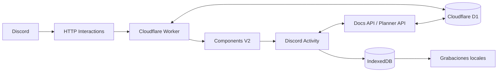

# Bardo

**Documentos y reuniones, sin salir de Discord.**

Bardo convierte un canal de Discord en un espacio de trabajo embebido para **crear, importar, leer y compartir documentación**, además de **planificar y conducir reuniones con agenda, tiempos, acuerdos y grabaciones**.

Todo ocurre dentro de una **Discord Activity** y se ejecuta sobre una arquitectura serverless con Cloudflare Workers y D1. No requiere un bot conectado permanentemente al Gateway ni un proceso Node ejecutándose 24/7.

Bardo se divide actualmente en dos espacios principales:

- **Docs** — documentación compartida, editor enriquecido, biblioteca y exportación.
- **Reuniones** — planificación, agenda en vivo, control de tiempos, acuerdos, grabaciones y recap.

---

## Docs

Docs permite trabajar con documentación directamente desde Discord, ya sea creando contenido en Bardo o importando archivos existentes.

### Crear documentos

Puedes crear un documento desde Discord con:

```text
/doc-new
```

También puedes hacerlo directamente desde la biblioteca de Bardo con **Crear documento**.

Cada documento dispone de:

- título;
- descripción;
- contenido enriquecido;
- autor;
- información del último cambio;
- estado activo o archivado;
- acceso asociado al servidor y canal de Discord correspondiente.

Los borradores se conservan mientras editas y Bardo mantiene un estado visible de guardado.

### Editor

Bardo incluye un editor de documentos basado en bloques, integrado directamente en la Activity.

Actualmente soporta:

- texto;
- encabezados H1, H2 y H3;
- negrita;
- cursiva;
- subrayado;
- tachado;
- código inline;
- bloques de código;
- enlaces;
- listas con viñetas;
- listas numeradas;
- listas de tareas interactivas;
- citas;
- destacados / callouts;
- tablas;
- separadores;
- bloques desplegables / spoilers.

El editor incluye además:

- toolbar adaptativa según el espacio disponible;
- menú de comandos con `/`;
- navegación del slash menu con teclado;
- undo / redo;
- limpieza de formato;
- copia del contenido;
- reordenamiento de bloques mediante drag handle;
- autosave;
- soporte responsive para la Activity de Discord.

### Importar documentos

Puedes subir archivos desde la propia biblioteca o mediante:

```text
/doc-upload
```

`/upload-docs` sigue disponible como alias de compatibilidad.

Formatos soportados:

| Formato | Soporte | Comportamiento |
| --- | --- | --- |
| `.md` / `.markdown` | ✅ | Se conserva como Markdown canónico |
| `.txt` | ✅ | Se normaliza al sistema de lectura de Bardo |
| `.docx` | ✅ | Se extrae y normaliza su estructura semántica |
| `.pdf` | ✅ | Se extrae el texto y se normaliza |
| `.doc` | ❌ | Debe convertirse previamente a `.docx` |

Bardo intenta conservar elementos como títulos, listas, tablas, énfasis y enlaces al importar documentos.

Los PDF escaneados que no contienen texto seleccionable todavía requieren OCR y no pueden reconstruirse automáticamente.

### Preview dentro del canal

Cuando un documento se comparte en Discord, Bardo publica una tarjeta utilizando **Discord Components V2**.

La tarjeta contiene:

- título;
- una vista previa corta del contenido;
- acceso directo mediante **Abrir documento**.

Al abrirlo, Discord inicia la Activity de Bardo y muestra el documento completo con scroll continuo.

No existe paginación manual para la lectura.

### Biblioteca

Cada canal dispone de su propio contexto de documentos.

Desde la biblioteca puedes:

- buscar documentos;
- abrir documentos;
- continuar la última lectura;
- crear documentos;
- subir archivos;
- editar;
- duplicar;
- copiar el contenido;
- compartir nuevamente un documento en el canal;
- archivar;
- restaurar documentos archivados;
- eliminar definitivamente.

Bardo recuerda además el último documento abierto y la posición aproximada de lectura para facilitar la continuación.

### Exportar

Un documento puede exportarse o copiarse como:

- Markdown (`.md`);
- HTML (`.html`);
- PDF (`.pdf`);
- Word (`.docx`);
- impresión / PDF del navegador.

También puedes abrir una vista previa de Markdown antes de descargarlo.

---

## Reuniones

Bardo incluye un segundo espacio dedicado a organizar y conducir reuniones directamente desde Discord.

Puedes crear una nueva reunión con:

```text
/reu-new
```

Y consultar las reuniones del canal con:

```text
/reus
```

### Planificación

Cada reunión puede contener:

- título;
- descripción u objetivo;
- fecha;
- hora de inicio;
- duración estimada;
- organizador;
- participantes;
- bloques de agenda;
- puntos dentro de cada bloque;
- responsables;
- breaks;
- acuerdos y decisiones.

Los bloques y puntos pueden añadirse, editarse, eliminarse y reordenarse.

Bardo recalcula los tiempos estimados de la reunión cuando cambia la agenda.

### Reunión en vivo

Una agenda puede convertirse en una sesión activa.

Durante la reunión, Bardo permite:

- iniciar la sesión;
- pausar;
- reanudar;
- avanzar al siguiente punto;
- avanzar al siguiente bloque;
- saltar puntos;
- saltar bloques;
- marcar temas como completados;
- extender un bloque;
- dejar un bloque sin límite de tiempo;
- registrar acuerdos;
- asociar responsables a los acuerdos;
- interrumpir una reunión conservando su estado;
- reanudar una reunión interrumpida;
- finalizar la sesión.

Bardo mantiene el contexto del bloque y del punto que están activos y utiliza esa información para relacionar acuerdos y grabaciones con el momento correcto de la agenda.

Cuando un bloque se acerca a su límite, Bardo puede advertir que quedan cinco minutos.

### Grabaciones

Durante una sesión puedes grabar audio directamente desde la Activity.

Bardo asocia automáticamente cada grabación con el bloque y, cuando corresponde, con el punto de agenda activo.

Las grabaciones pueden:

- iniciarse;
- pausarse;
- reanudarse;
- finalizarse;
- guardarse;
- descartarse;
- reproducirse;
- navegarse mediante una barra de progreso;
- renombrarse;
- eliminarse.

También se muestran datos técnicos como duración, formato, tamaño y número de segmentos.

El binario de audio se persiste actualmente en **IndexedDB** del navegador para permitir recuperarlo al volver a abrir la sesión desde el mismo entorno.

### Acuerdos y decisiones

Durante la sesión se pueden registrar decisiones sin abandonar la agenda.

Cada acuerdo puede almacenar:

- contenido;
- bloque relacionado;
- punto relacionado;
- responsable opcional;
- momento de captura.

Los acuerdos permanecen asociados al contexto de la reunión y aparecen posteriormente en el recap.

### Recap

Al finalizar o interrumpir una sesión, Bardo construye un resumen estructurado con:

- tiempo efectivo;
- tiempo planificado;
- bloques completados;
- bloques saltados;
- temas tratados;
- temas saltados;
- cantidad y duración de grabaciones;
- decisiones y acuerdos registrados.

Desde el recap puedes:

- copiar un resumen listo para compartir;
- reproducir las grabaciones organizadas por bloque y punto;
- revisar acuerdos y responsables;
- reanudar una reunión interrumpida;
- crear una nueva reunión;
- guardar el acta como un documento dentro de **Docs**.

De esta forma, Docs y Reuniones no funcionan como herramientas aisladas: el resultado de una reunión puede convertirse directamente en documentación del canal.

### Historial

Bardo diferencia reuniones:

- programadas;
- en curso;
- pausadas;
- interrumpidas;
- finalizadas;
- archivadas.

Las reuniones archivadas pueden restaurarse o eliminarse definitivamente.

---

## Comandos de Discord

Bardo registra actualmente los siguientes comandos:

| Comando | Función |
| --- | --- |
| `/doc-upload` | Importa un archivo a Docs y lo comparte con el canal |
| `/upload-docs` | Alias legado de `/doc-upload` |
| `/doc-new` | Crea un nuevo documento en Bardo |
| `/reu-new` | Crea y agenda una nueva reunión |
| `/reus` | Muestra las reuniones del canal |

Para registrar los comandos:

```bash
npm run register
```

El script utiliza `PUT` sobre los comandos del guild, por lo que reemplaza la colección actual de comandos de esa aplicación por los comandos definidos por Bardo.

---

## Arquitectura

Bardo utiliza una arquitectura serverless.



### Discord HTTP Interactions

Los slash commands y botones llegan al Worker mediante HTTP Interactions.

No es necesario mantener una conexión permanente con Discord Gateway.

### Components V2

Bardo utiliza Components V2 para publicar previews de documentos, reuniones y accesos a la Activity directamente en el canal.

### Discord Activity

La interfaz principal se ejecuta como una aplicación React embebida en Discord.

La Activity contiene:

- biblioteca de Docs;
- lector;
- editor;
- importadores;
- exportadores;
- Planner de reuniones;
- sesión en vivo;
- reproductor de grabaciones;
- recap.

### Cloudflare Workers

Cloudflare Workers sirve como backend serverless de Bardo y también entrega los assets estáticos de la Activity.

Las rutas `/api/*` son procesadas por el Worker antes de los assets estáticos.

### Cloudflare D1

D1 almacena, entre otros datos:

- documentos normalizados;
- metadatos;
- contexto de acceso por guild;
- acceso por canal;
- sesiones de la Activity;
- intents de apertura;
- información de reuniones;
- estado compartido de sesiones.

Para PDF y DOCX importados desde Discord, Bardo puede almacenar temporalmente el archivo fuente mientras se normaliza.

Cuando la normalización termina, el documento canónico queda almacenado y el binario fuente se elimina.

### IndexedDB

Las grabaciones utilizan almacenamiento local mediante IndexedDB.

Esto evita introducir archivos de audio pesados directamente en D1 y permite recuperar grabaciones persistidas desde el navegador que las creó.

---

## Seguridad y acceso

Bardo no trata los documentos como recursos públicos.

El acceso se determina a partir del contexto autenticado de Discord y contempla:

- usuario;
- servidor / guild;
- canal;
- permisos para visualizar ese canal.

Los documentos mantienen ACL por guild y canal, y la API comprueba que la sesión actual tenga acceso antes de entregar contenido o archivos fuente.

Además:

- `.env` y credenciales permanecen fuera del repositorio;
- los secretos de producción viven en Cloudflare Secrets;
- las respuestas privadas de la API utilizan `Cache-Control: private, no-store`;
- los archivos binarios temporales de importación no permanecen almacenados después de normalizarse;
- los documentos utilizan identificadores opacos;
- Bardo evita generar menciones accidentales al publicar sus Components en Discord.

---

## Límites actuales

El contenido normalizado de un documento tiene actualmente un límite de:

```text
1.800.000 bytes
```

aproximadamente **1,8 MB**.

Este límite mantiene cada documento dentro del modelo de almacenamiento utilizado actualmente por Bardo.

También existen estas limitaciones:

- Word `.doc` legado no está soportado;
- PDF escaneado sin texto seleccionable todavía requiere OCR;
- el audio de las reuniones se almacena localmente en IndexedDB;
- algunas capacidades de exportación dependen del entorno de producción de la Activity.

---

## Stack

La implementación actual utiliza principalmente:

- React 19;
- Vite 8;
- Discord Embedded App SDK;
- Discord.js;
- Cloudflare Workers;
- Cloudflare D1;
- Plate;
- Tailwind CSS 4;
- shadcn;
- Base UI / Radix UI;
- Motion;
- Gravity UI Icons;
- Mammoth;
- unPDF;
- Turndown;
- pdf-lib.

---

## Requisitos

- Node.js **22.12 o superior**.
- Aplicación Bardo creada en Discord Developer Portal.
- Cuenta de Cloudflare.
- Wrangler autenticado.
- Base de datos D1 configurada.

---

## Instalación local

Instala las dependencias del backend y de la Activity:

```bash
npm ci
npm ci --prefix activity-app
```

Crea el archivo de variables locales:

```bash
cp .env.example .env
```

`.env` se utiliza para tareas locales como registrar los comandos del guild:

```env
DISCORD_TOKEN=pega_aqui_el_token_del_bot
DISCORD_GUILD_ID=pega_aqui_el_id_de_tu_servidor
```

---

## Registrar los comandos

```bash
npm run register
```

Esto registra:

```text
/doc-upload
/upload-docs
/doc-new
/reu-new
/reus
```

---

## Cloudflare

Autentica Wrangler:

```bash
npx wrangler login
```

Aplica las migraciones:

```bash
npx wrangler d1 migrations apply bardo-db --remote
```

Configura los secretos de producción:

```bash
npx wrangler secret put DISCORD_PUBLIC_KEY
npx wrangler secret put DISCORD_TOKEN
npx wrangler secret put DISCORD_CLIENT_SECRET
```

Despliega:

```bash
npm run deploy
```

Worker actual:

```text
https://bardo-discord.bardo-discord.workers.dev
```

---

## Discord · Interactions Endpoint

En:

**Discord Developer Portal → Bardo → Información general**

configura:

```text
https://bardo-discord.bardo-discord.workers.dev
```

---

## Discord · Activity

En:

**Activities / Actividades → Settings / Configuración**

configura:

```text
Prefix: /
Target: bardo-discord.bardo-discord.workers.dev
```

---

## Desarrollo

Inicia Bardo localmente:

```bash
npm run dev
```

El comando construye primero la Activity y luego inicia Wrangler.

### Validaciones

```bash
npm run check
```

Ejecuta lint, build y comprobaciones de sintaxis del backend.

### Tests

```bash
npm test
```

La aplicación de la Activity también dispone de sus propias validaciones:

```bash
npm --prefix activity-app run check
npm --prefix activity-app run test:e2e
```

---

## Filosofía

Bardo busca que la documentación y las reuniones formen parte de la conversación del equipo en lugar de vivir como herramientas completamente separadas.

Un archivo compartido en un canal puede convertirse en un documento editable. Una reunión puede construirse desde una agenda, ejecutarse en vivo y terminar como un acta dentro de Docs.

**Discord sigue siendo el punto de encuentro. Bardo añade la capa de trabajo alrededor de él.**
